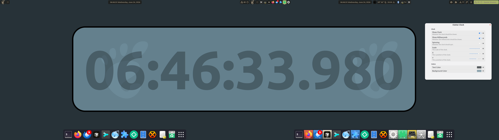

# ClutterClock
Scalable, moveable, customizable desktop clock available as an extension for 
[Gnome-Shell](https://www.gnome.org/). The clock sits on top of your windows, but it is transparent
to mouse interaction, meaning a click of the mouse would target the windows behind the clock. It's
possible to change the colors of the clock text and the clock's background. And, oh yeah, it spins, 
if you want. Make it as big or small as you want! Move it around! 

